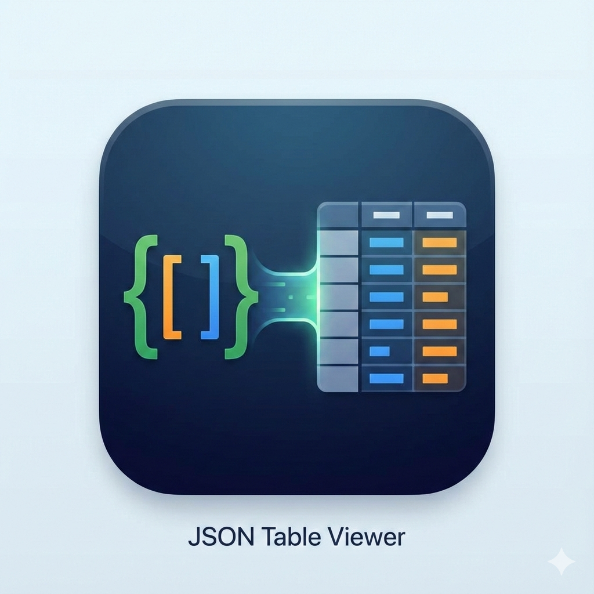

<p align="center">
  
</p>

# JSON Table Viewer

[](https://godotengine.org)
[](LICENSE)

一个基于 Godot 引擎开发的 JSON 数据查看与编辑器。它能够将特定结构的 JSON 文件转换为直观的二维表格，方便用户进行查看和快速编辑。

## ✨ 主要特性

- **表格化展示**：自动将 JSON 列表转换为二维表格。
- **自动表头识别**：根据 JSON 字典中的键（Key）自动生成表头，并保持原始顺序。
- **实时编辑**：支持在表格中直接修改数据并保存。
- **结构化支持**：专为“对象列表”格式优化。

## 📂 数据格式要求

为了能够正确解析为表格，JSON 文件应遵循以下结构：

1. 根节点必须是一个 **列表 (Array)**。
2. 列表中的每一项必须是一个 **字典 (Dictionary/Object)**。
3. 建议所有字典拥有相同的键（Key），这些键将作为表格的列名。

### 示例数据 (`example.json`)

```json
[
  {
	"id": 0,
	"name": "体能",
	"var": "physique",
	"description": "基础身体素质"
  },
  {
	"id": 1,
	"name": "智慧",
	"var": "wisdom",
	"description": "逻辑与知识储备"
  }
]
```

## 🚀 如何使用

1. **打开文件**：运行程序后，选择需要查看的 `.json` 文件。
2. **查看数据**：程序会自动解析并渲染为表格。
3. **编辑数据**：点击单元格即可进行编辑（如果已实现编辑功能）。
4. **保存更改**：点击保存按钮将修改后的数据写回 JSON 文件。

## 🛠️ 开发相关

本项目使用 **Godot 4.x** 开发。

### 项目结构
- `scenes/`: 存放场景文件（如 `main.tscn`）。
- `scripts/`: 存放 GDScript 脚本（如 `main.gd`）。
- `assets/`: 存放字体、图标等资源文件。
- `localization/`: 存放多语言翻译文件。
- `data/`: 存放示例 JSON 数据。

## 📄 开源协议

本项目采用 [MIT License](LICENSE) 开源协议。
